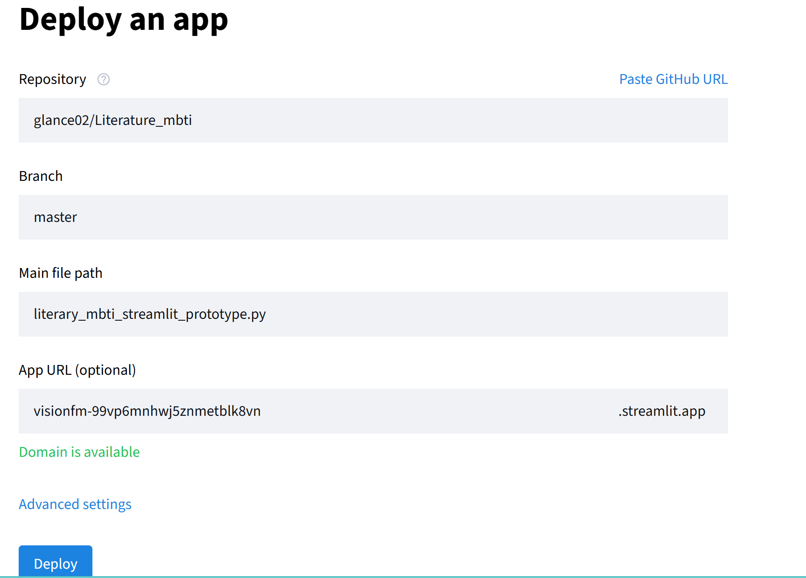

# Literature_mbti
## 本地部署
**1.python环境配置**

注意本地部署用于调试文件，其他设备无法通过该网站访问此问卷

有多种工具可以管理python环境，再次只展示使用anaconda的方法

-  创建虚拟环境
    `conda create -n literary_mbti python=3.13`

- 安装需要的库
    `conda activate literary_mbti`
    
    `pip install streamlit pandas numpy pyarrow`

 **2.本地运行文件**

`streamlit run literary_mbti_streamlit_full.py`

## 云端部署
1. 注册/登录
2. 
   在https://share.streamlit.io/ 网站中登录或注册自己的账号，建议直接使用github账号进行登录。

3. fork该仓库

4. 点击streamlit的`create app`，创建项目，选择该仓库以及对应的分支和文件。
   

5. 打开该问卷，该页面的网址即可以使用其他设备打开

